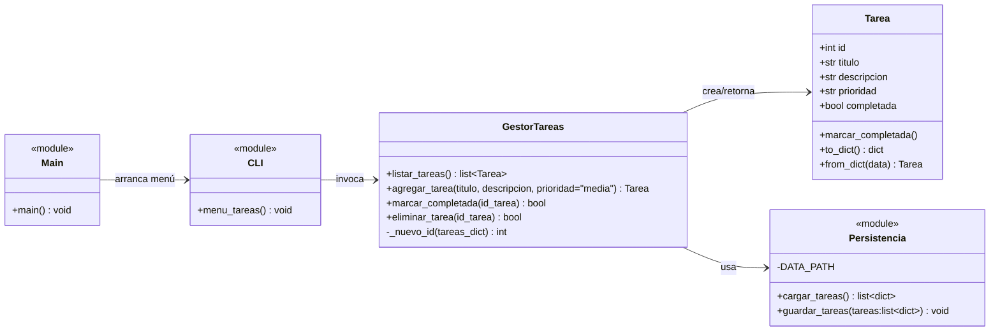
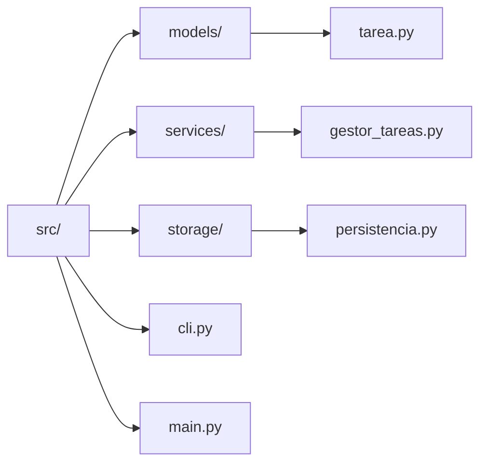
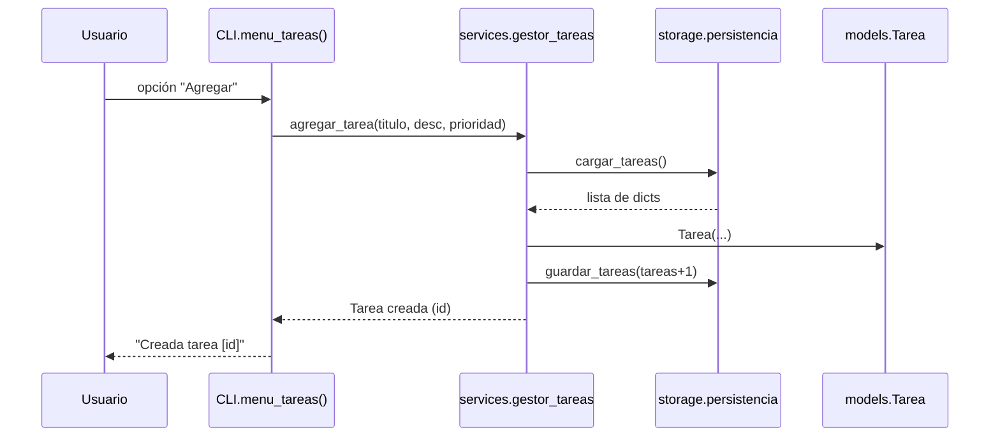

# PRACTICA_TPA

# Gestor CLI de Tareas, Presupuestos e Inventario

Proyecto desarrollado para la asignatura **Técnicas de Programación Avanzada**.
Incluye CLI, persistencia JSON, pruebas unitarias y CI automatizada con GitHub Actions.

## Documentacion Automatica

La documentacion se genera con [pdoc](hhtps://pdoc.dev):

## Arquitectura (PRAC2)

### Diagrama de clases

**Explicación:**  
El diagrama de clases muestra la estructura lógica del módulo de Tareas.  
Define las relaciones entre las clases `Tarea`, `GestorTareas`, `Persistencia`, `CLI` y `Main`, destacando cómo `GestorTareas` coordina las operaciones de creación y persistencia de datos.

### Diagrama de paquetes

**Explicación:**  
Este diagrama representa la organización modular del proyecto.  
Cada carpeta contiene responsabilidades bien definidas: `models` para las entidades, `services` para la lógica de negocio, y `storage` para la persistencia, mientras que `cli.py` y `main.py` gestionan la interfaz de usuario y la ejecución principal.

### Flujo: agregar tarea

**Explicación:**  
El diagrama de secuencia describe el flujo de interacción cuando un usuario agrega una tarea.  
Muestra cómo las llamadas entre `CLI`, `GestorTareas`, `Persistencia` y `Tarea` cooperan para almacenar la información y devolver una confirmación al usuario.
