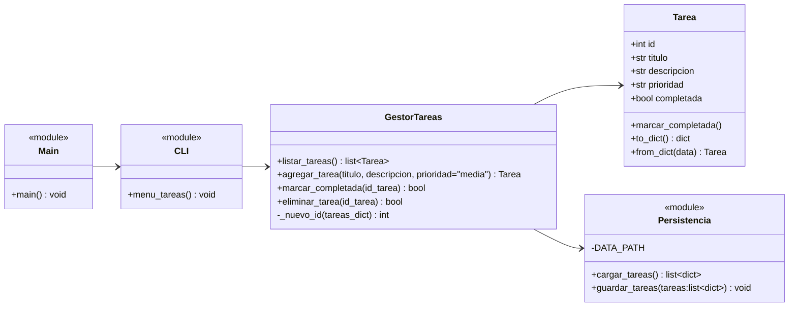
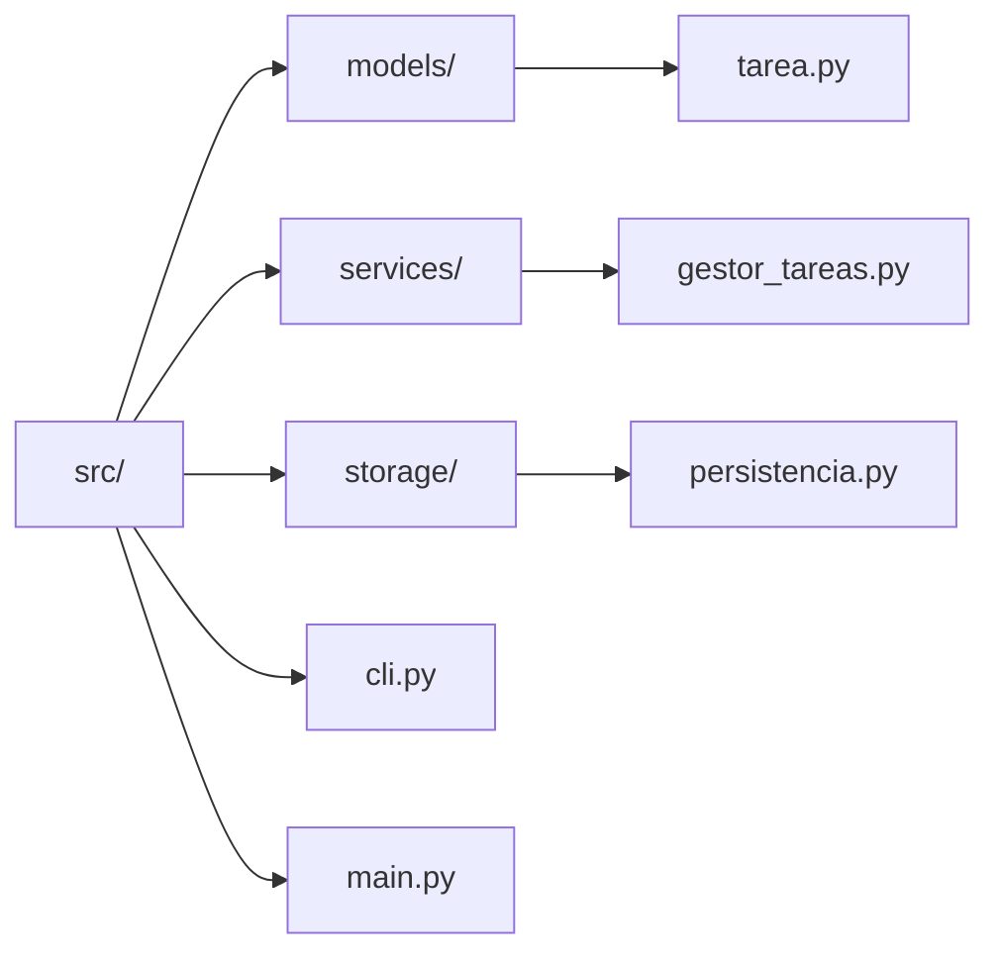
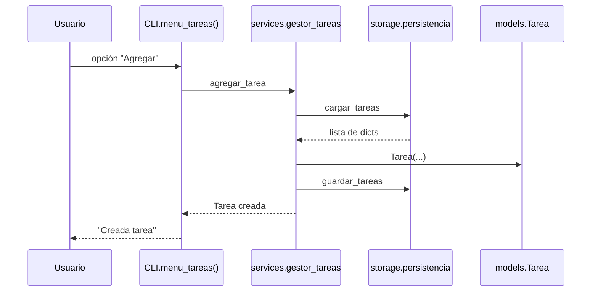
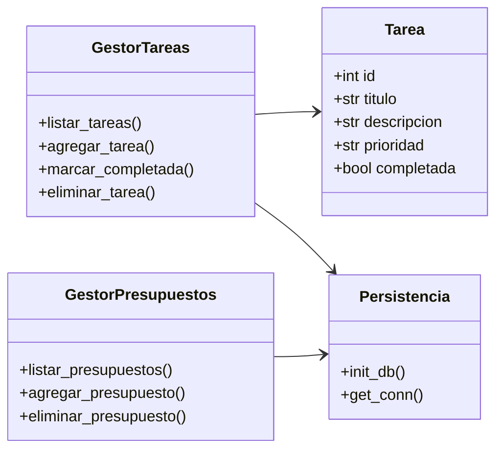

# PRACTICA_TPA – Gestor CLI de Tareas, Presupuestos e Inventario


[](https://codecov.io/gh/mduartel1/PRACTICA_TPA)

Proyecto desarrollado para la asignatura **Técnicas de Programación Avanzada**, con un enfoque modular y profesional.  
Incluye un **CLI completo**, persistencia en **SQLite**, logging avanzado, pruebas unitarias e integración, CI automatizado con GitHub Actions, documentación generada con pdoc y diagramas oficiales.

---

# 🧭 Índice

1. Descripción general  
2. Funcionalidades principales  
3. Guía de uso del CLI  
4. Instalación y ejecución  
5. Ejecución de la GUI  
6. Estructura del proyecto  
7. Arquitectura del proyecto  
8. Diagramas oficiales PRAC2–PRAC3  
9. Persistencia (SQLite)  
10. Logging  
11. Tests y cobertura  
12. Documentación automática  
13. Changelog  
14. Contribuciones  
15. Atribuciones  

---

# 📝 Descripción general

Este proyecto implementa un **gestor de tareas, presupuestos e inventario**, accesible tanto mediante un CLI como mediante una **interfaz gráfica (GUI) con PySide6**, usando persistencia robusta con SQLite, pruebas automatizadas con Pytest, cobertura con Codecov, documentación con pdoc y CI/CD mediante GitHub Actions.  

Es la **versión final PRAC4 (v1.0.0)** del proyecto de Técnicas de Programación Avanzada.

---

# ⚙️ Funcionalidades principales

## ✔ Gestión de tareas
- Crear tareas  
- Listarlas  
- Marcar como completadas  
- Eliminar por ID  
- Persistencia con SQLite  
- Logging completo  

## ✔ Gestión de presupuestos
- Registrar ingresos y gastos  
- Listado completo  
- Eliminación por identificador  
- Tabla `presupuestos` en SQLite  

## ✔ Gestión de inventario (PRAC4)
- Añadir productos al inventario  
- Listado completo con cálculo de **Total = cantidad × precio**  
- Actualización de cantidad  
- Eliminación de items  
- Tabla `inventario` en SQLite  
- Acceso desde CLI y desde la GUI  

---

# 💻 Guía de uso del CLI

Ejecutar:

```bash
python3 -m src.main
```

Menú principal:

```
1. Tareas
2. Presupuestos
3. Inventario
4. Salir
```

---

# 🖥 Ejecución de la GUI

Para usar la interfaz gráfica en lugar del CLI:

```bash
python src/gui.py
```

La GUI ofrece:

- Pestañas para **Tareas**, **Presupuestos** e **Inventario**  
- Tablas con estilos modernos y filas alternas  
- Diálogos modales para alta y edición de datos  
- Estilo visual coherente (inspirado en macOS)  
---

# 🔧 Instalación y ejecución

```bash
git clone https://github.com/mduartel1/PRACTICA_TPA.git
cd PRACTICA_TPA

python3 -m venv .venv
source .venv/bin/activate

pip install -r requirements.txt

python -c "from src.storage.database import init_db; init_db()"

python src/gui.py
```

La ejecución por defecto en PRAC4 se realiza mediante la GUI (`src/gui.py`), que incluye módulos completos de Tareas, Presupuestos e Inventario.

---

# 🗂 Estructura del proyecto

```
PRACTICA_TPA/
 ├── src/
 │    ├── cli.py
 │    ├── main.py
 │    ├── models/
 │    ├── services/
 │    ├── storage/
 │    └── utils/
 ├── tests/
 ├── docs/
 ├── data/
 ├── logs/
 └── README.md
```

---

# 🧱 Arquitectura del proyecto

El proyecto sigue una arquitectura modular clara:

- `cli/`: interacción del usuario  
- `gui.py`: interfaz gráfica con PySide6  
- `services/`: lógica de negocio  
- `models/`: entidades del sistema  
- `storage/`: persistencia SQLite y JSON  
- `utils/`: logging centralizado  
- `tests/`: pruebas unitarias y de integración  

---

# 📊 Diagramas oficiales PRAC2–PRAC3

## 📘 Diagrama de clases (PRAC2)



---

## 📘 Diagrama de paquetes (PRAC2)



---

## 📘 Diagrama de secuencia – Agregar tarea (PRAC2)



---

## 📘 Arquitectura PRAC3 – SQLite + Presupuestos



---

# 🗄 Persistencia (SQLite)

Base de datos en:

```
data/gestor.db
```

Incluye las tablas:

- `tareas`
- `presupuestos`
- `inventario`

---

# 📜 Logging

Configuración centralizada en:

```
src/utils/logging_config.py
```

Niveles:

- INFO  
- WARNING  
- ERROR  

Salida en:

```
logs/gestor.log
```

---

# 🧪 Tests y cobertura

```
pytest --cov=src --cov-report=term-missing
```

Resultados PRAC4:

- 12 tests en verde  
- Test de integración CLI → SQLite  
- Cobertura total: **74 %**  
- CI completamente en verde  

---

# 📚 Documentación automática

Generar:

```bash
pdoc -o docs src
```

---

# 🕒 Changelog

## v1.0.0 – PRAC4 (Final)
- Cobertura ≥ 70 %  
- Test de integración  
- README final completo  
- Documentación actualizada  
- CI/CD estable  
- Informe PRAC4  
- Implementación completa del módulo de inventario sobre SQLite  
- Añadida GUI opcional con PySide6 para tareas, presupuestos e inventario  

## v0.3.0 – PRAC3
- Migración a SQLite  
- Gestión de presupuestos  
- Logging  
- Primeros tests  

---

# 👥 Contribuciones

| Autor | Aportación |
|-------|------------|
| **Mario Duarte Lanseros** | Desarrollo completo del CLI, servicios, SQLite, logging, pruebas, CI/CD, documentación y presentación. |
| **Jose Andreu Latras** | Desarrollo completo del CLI, servicios, SQLite, logging, pruebas, CI/CD, documentación y presentación. |
| **Geronimo Gonzalez Ferrer** | Desarrollo completo del CLI, servicios, SQLite, logging, pruebas, CI/CD, documentación y presentación. |
| **Hugo Fernandez Alvarez** | Desarrollo completo del CLI, servicios, SQLite, logging, pruebas, CI/CD, documentación y presentación. |
| **Javier De Pablos** | Desarrollo completo del CLI, servicios, SQLite, logging, pruebas, CI/CD, documentación y presentación. |

---
