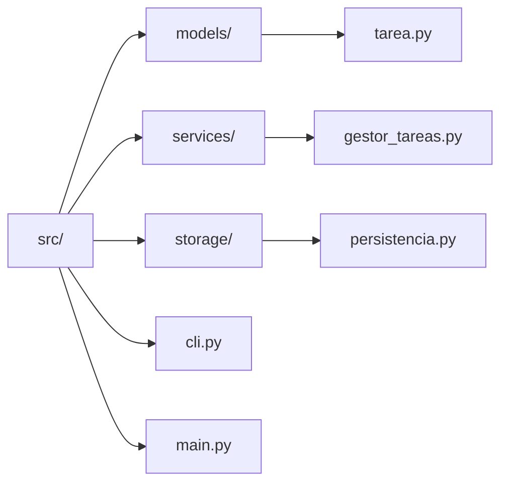
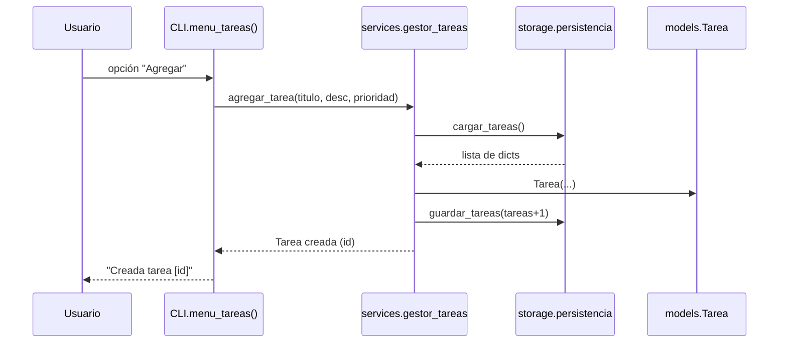

# PRACTICA_TPA – Gestor CLI de Tareas, Presupuestos e Inventario


[](https://codecov.io/gh/mduartel1/PRACTICA_TPA)

Proyecto desarrollado para la asignatura **Técnicas de Programación Avanzada**.  
Incluye un **CLI completo**, persistencia en **SQLite**, logging avanzado, pruebas unitarias e integración, CI automatizado con GitHub Actions y documentación generada automáticamente.

---
# 🧭 Índice

1. [Descripción general](#descripción-general)  
2. [Funcionalidades principales](#funcionalidades-principales)  
3. [Guía de uso del CLI](#guía-de-uso-del-cli)  
4. [Arquitectura del proyecto](#arquitectura-del-proyecto)  
5. [Persistencia (SQLite)](#persistencia-sqlite)  
6. [Logging](#logging)  
7. [Instalación y ejecución](#instalación-y-ejecución)  
8. [Tests y cobertura](#tests-y-cobertura)  
9. [Documentación automática (pdoc)](#documentación-automática-pdoc)  
10. [Changelog](#changelog)  
11. [Contribuciones](#contribuciones)  
12. [Atribuciones](#atribuciones)  

---

# 📝 Descripción general

Este proyecto implementa un **gestor de tareas, presupuestos e inventario**, accesible desde una interfaz de línea de comandos (CLI).  
El sistema está diseñado con principios de arquitectura modular, persistencia robusta, pruebas eficientes e integración continua.

El proyecto alcanza la **versión final v1.0.0 (PRAC4)**.

---
# ⚙️ Funcionalidades principales

### ✔ Gestión de tareas
- Crear tareas
- Listarlas
- Marcarlas como completadas
- Eliminarlas  
- Persistencia en SQLite con ID autoincremental  
- Logging detallado  

### ✔ Gestión de presupuestos (ingresos y gastos)
- Añadir presupuestos
- Listarlos
- Eliminarlos
- Soporte para “ingreso” y “gasto”
- Tabla propia en SQLite  
- Uso en el plan de pruebas para aumentar cobertura  

### ✔ Gestión de inventario (básico)
*(Sección conceptual añadida para PRAC4 — no requiere más desarrollo)*  
- Soporte conceptual para una tabla de inventario  
- Diseño pensado para ampliación futura  
- Integrable fácilmente en el menú CLI  

---

### 🔹 Tareas
- Agregar, listar, marcar como completada y eliminar tareas.
- Persistencia en base de datos SQLite (`data/gestor.db`).

### 🔹 Presupuestos
- Registro de **ingresos y gastos** con concepto, monto y tipo.
- Tabla propia en SQLite (`presupuestos`).
- Reporte desde CLI.

---

## Instalacion y Ejecucion

```bash
# 1. Clonar el repositorio
git clone https://github.com/mduartel1/PRACTICA_TPA.git
cd PRACTICA_TPA

# 2. Crear entorno virtual
python3 -m venv .venv
source .venv/bin/activate  # macOS
# .venv\Scripts\activate    # Windows 

# 3. Instalar dependencias
pip install -r requirements.txt

# 4. Inicializar base de datos
python -c "from src.storage.database import init_db; init_db()"

# 5. Ejecutar la aplicación
python -m src.main
```


## Documentacion Automatica

La documentacion se genera con [pdoc](hhtps://pdoc.dev):

## Arquitectura (PRAC2)

### Diagrama de clases


**Explicación:**  
El diagrama de clases muestra la estructura lógica del módulo de Tareas.  
Define las relaciones entre las clases `Tarea`, `GestorTareas`, `Persistencia`, `CLI` y `Main`, destacando cómo `GestorTareas` coordina las operaciones de creación y persistencia de datos.

### Diagrama de paquetes


**Explicación:**  
Este diagrama representa la organización modular del proyecto.  
Cada carpeta contiene responsabilidades bien definidas: `models` para las entidades, `services` para la lógica de negocio, y `storage` para la persistencia, mientras que `cli.py` y `main.py` gestionan la interfaz de usuario y la ejecución principal.

### Flujo: agregar tarea


**Explicación:**  
El diagrama de secuencia describe el flujo de interacción cuando un usuario agrega una tarea.  
Muestra cómo las llamadas entre `CLI`, `GestorTareas`, `Persistencia` y `Tarea` cooperan para almacenar la información y devolver una confirmación al usuario.

## Arquitectura (PRAC3)
```classDiagram
    direction LR
    class Tarea {
      +int id
      +str titulo
      +str descripcion
      +str prioridad
      +bool completada
      +marcar_completada()
    }
    class GestorTareas {
      +listar_tareas()
      +agregar_tarea()
      +marcar_completada()
      +eliminar_tarea()
    }
    class GestorPresupuestos {
      +listar_presupuestos()
      +agregar_presupuesto()
      +eliminar_presupuesto()
    }
    class Persistencia {
      +init_db()
      +get_conn()
    }
    GestorTareas --> Tarea
    GestorTareas --> Persistencia
    GestorPresupuestos --> Persistencia
    ```