# PRACTICA_TPA

[](https://codecov.io/gh/mduartel1/PRACTICA_TPA)

# Gestor CLI de Tareas, Presupuestos e Inventario

Proyecto desarrollado para la asignatura **Técnicas de Programación Avanzada**.
Incluye CLI, persistencia con **SQLite**, pruebas unitarias, **logging**, documentación automática y CI con GitHub Actions.

---

## 🧩 Funcionalidades principales

### 🔹 Tareas
- Agregar, listar, marcar como completada y eliminar tareas.
- Persistencia en base de datos SQLite (`data/gestor.db`).

### 🔹 Presupuestos
- Registro de **ingresos y gastos** con concepto, monto y tipo.
- Tabla propia en SQLite (`presupuestos`).
- Reporte desde CLI.

---

## Instalacion y Ejecucion

```bash
# 1. Clonar el repositorio
git clone https://github.com/mduartel1/PRACTICA_TPA.git
cd PRACTICA_TPA

# 2. Crear entorno virtual
python3 -m venv .venv
source .venv/bin/activate  # macOS
# .venv\Scripts\activate    # Windows 

# 3. Instalar dependencias
pip install -r requirements.txt

# 4. Inicializar base de datos
python -c "from src.storage.database import init_db; init_db()"

# 5. Ejecutar la aplicación
python -m src.main
```


## Documentacion Automatica

La documentacion se genera con [pdoc](hhtps://pdoc.dev):

## Arquitectura (PRAC2)

### Diagrama de clases


**Explicación:**  
El diagrama de clases muestra la estructura lógica del módulo de Tareas.  
Define las relaciones entre las clases `Tarea`, `GestorTareas`, `Persistencia`, `CLI` y `Main`, destacando cómo `GestorTareas` coordina las operaciones de creación y persistencia de datos.

### Diagrama de paquetes


**Explicación:**  
Este diagrama representa la organización modular del proyecto.  
Cada carpeta contiene responsabilidades bien definidas: `models` para las entidades, `services` para la lógica de negocio, y `storage` para la persistencia, mientras que `cli.py` y `main.py` gestionan la interfaz de usuario y la ejecución principal.

### Flujo: agregar tarea

```mermaid
sequenceDiagram
    participant U as Usuario
    participant CLI as CLI.menu_tareas()
    participant S as services.gestor_tareas
    participant P as storage.persistencia
    participant M as models.Tarea

    U->>CLI: opción "Agregar"
    CLI->>S: agregar_tarea(titulo, desc, prioridad)
    S->>P: cargar_tareas()
    P-->>S: lista de dicts
    S->>M: Tarea(...)
    S->>P: guardar_tareas(tareas+1)
    S-->>CLI: Tarea creada (id)
    CLI-->>U: "Creada tarea [id]"
```


**Explicación:**  
El diagrama de secuencia describe el flujo de interacción cuando un usuario agrega una tarea.  
Muestra cómo las llamadas entre `CLI`, `GestorTareas`, `Persistencia` y `Tarea` cooperan para almacenar la información y devolver una confirmación al usuario.

## Arquitectura (PRAC3)
```classDiagram
    direction LR
    class Tarea {
      +int id
      +str titulo
      +str descripcion
      +str prioridad
      +bool completada
      +marcar_completada()
    }
    class GestorTareas {
      +listar_tareas()
      +agregar_tarea()
      +marcar_completada()
      +eliminar_tarea()
    }
    class GestorPresupuestos {
      +listar_presupuestos()
      +agregar_presupuesto()
      +eliminar_presupuesto()
    }
    class Persistencia {
      +init_db()
      +get_conn()
    }
    GestorTareas --> Tarea
    GestorTareas --> Persistencia
    GestorPresupuestos --> Persistencia
    ```